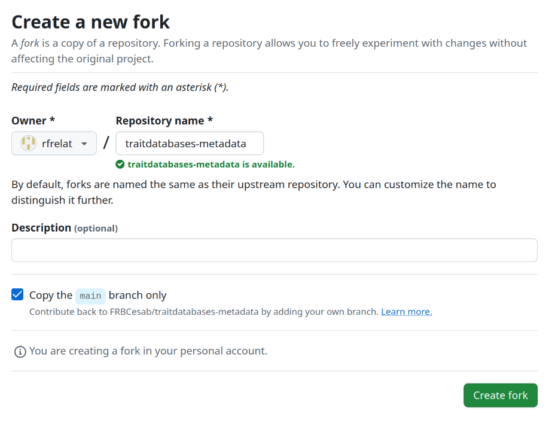

# Trait databases: Metadata submission repo


<!-- badges: start -->
[](https://creativecommons.org/licenses/by/4.0/)

<!-- badges: end -->


<p align="left">
• <a href="#overview">Overview</a><br> •
  <a href="#description">Description</a><br> • 
  <a href="#get-started">Get started</a><br> • 
  <a href="#contributing">Contributing</a><br> •
  <a href="#citation">Citation</a><br> •
  <a href="#acknowledgments">Acknowledgments</a><br> •
  <a href="#references">References</a>
</p>


## Overview

This repository is a bank centralizing metadata files describing various published trait databases.

Its content (folder `metadata/`) is used by the R package [`traitdatabases`](https://github.com/frbcesab/traitdatabases) to download, import, clean, and homogenize trait data.


## Description

The metadata file describes all information needed to document and process the trait database. It is structured in four sections:

- `status`: the status of the metadata file
- `dataset`: general metadata of the dataset
- `taxonomy`: information about taxonomic columns
- `traits`: description of the trait data


### Section 'status'

| Tag name          | Description                                                                                                 | Example        |
| :---------------: | :---------------------------------------------------------------------------------------------------------- | :------------- |
| `status`          | The status of the metadata file. Should be one of:<br>- `draft`<br>- `incomplete` (some metadata need to be added)<br>-  `complete` (all metadata has been filled in) | `draft` |


### Section 'dataset'

| Tag name          | Description                                                                                                 | Example        |
| :---------------: | :---------------------------------------------------------------------------------------------------------- | :------------- |
| `id`              | The dataset identifier[^1]. It's up to you to choose this identifier. Can be the name of the database, the first author and year, etc. | `hodgson_2023` |
| `title`           | The dataset title. Typically the title of the (data) paper. | "A functional trait database of arable weeds from Eurasia and North Africa" |
| `description`     | A short description of the dataset | "The functional traits of \[…\] for 928 arable weed species." |
| `license`         | The dataset license. | `CC BY-SA 4.0` |
| `bibtex`          | The name of the dataset citation file in a BibTex format (optional) | `hodgson_2023.bib` |
| `doi`             | The Digital Object Identifier (DOI) of the dataset description | `10.5287/ora-pp4y9nkoz` |
| `url`             | The URL of the dataset description (paper) | <https://ora.ox.ac.uk/objects/uuid:abafafd9-e8a2-4e84-a339-0a11bf2858ae> |
| `taxon`           | The taxonomic group (mammals, birds, etc.) | `plants` |
| `taxonomic_level` | The taxonomic resolution (individuals, species, genus, etc.) | `species` |
| `type`            | One of:<br>-  `static` (a file that can be downloaded)<br>- `api` (access data through a query) | `static` |
| `file_url`        | The full URL to download the static file.<br>**NB.** Equal to `.na` if `type: api` | <https://ora.ox.ac.uk/objects/uuid:abafafd9-e8a2-4e84-a339-0a11bf2858ae/files/s8p58pf68w> |
| `file_name`       | The name of the static file (with file extension).<br>**NB.** Equal to `.na` if `type: api` | `Functional+trait+database+of+arable+`<br>`weeds+from+Eurasia+and+`<br>`North+Africa.xlsx` |
| `file_extension`  | The file extension of the static file.<br>**NB.** Equal to `.na` if `type: api` | `.xlsx` |
| `manual_download` | Need manuel download? <br> One of ‘yes’ (if Wiley) or ‘no’ (most cases) | no |
| `sheet`           | Sheet number for xslx dataset <br> NA if not in xlsx format | 1 |
| `long_format`     | Format of the trait database. One of ‘yes’ (long) or ‘no’ (wide, most commun) | no |
| `skip_rows`       | Number of header rows to remove, if any | 0 |
| `col_separator`   | Character used to separate columns (for text file or csv) | .na |
| `na_value`        | Character used for missing values | NA |
| `comment`         | add any relevant comment, if any |  |


### Section 'taxonomy'

| Tag name          | Description                                                                                                 | Example        |
| :---------------: | :---------------------------------------------------------------------------------------------------------- | :------------- |
| `genus`           | Column name of the genus <br>(when species name separated from genus) | NA |
| `species`         | Column name of the species <br>(when species name separated from genus) | NA |
| `binomial`        | Column name of the binomial name | Species |

[^1]: The dataset identifier should be short and should only contain letters, numbers and the symbol `_`.


### Section 'traits'

| Tag name          | Description                                                                                                 | Example        |
| :---------------: | :---------------------------------------------------------------------------------------------------------- | :------------- |
| `variable` | Column name of the trait (as in the data file) | SLA                |
| `name`     | Full name of the trait                         | Specific leaf area |
| `category` | Category of the trait                          | Leaf morphology    |
| `type`     | One of ‘quantitative’ or ‘categoric’           | quantitative       |
| `units`    | Original unit                                  | mm2.mg-1           |

In the case of categorical traits, all categories should be listed with
two informations (‘value’ and ‘description’). These information describe
each level of the categorical traits. For instance, in yaml format:

    - variable: VEGPROP      
      name: Vegetative propagation of perennials
      category: reproduction
      type: categorical      
      units: .na 
      levels: 
      - value: 1            
        description: yes
      - value: 0 
        description: no 

In excel, make sure to add a new lines for every label.


## Get started

Follow this 6-steps procedure to add a new metadata in the
`traitdatabases` package.  
Before proceeding, make sure that the dataset you want to add is not
already in `traitdatabases-metadata`. Have a look at the example from
the [metadata of Hodgson et
al. 2023](https://github.com/FRBCesab/traitdatabases-metadata/blob/main/metadata/hodgson_2023/hodgson_2023_metadata.yml)
to understand which information is expected in each field.

#### 1. Fork this repository

Click on the fork icon on the top right of this folder.

<figure>

<figcaption aria-hidden="true">click on ‘Create fork’</figcaption>
</figure>

#### 2. Install the traitdatabases package

``` r
## Install < remotes > package (if not already installed) ----
if (!requireNamespace(c("remotes", "here"), quietly = TRUE)) {
  install.packages(c("remotes", "here"))
}

## Install < traitdatabases > from GitHub ----
remotes::install_github("frbcesab/traitdatabases")
```

#### 3. Create a new empty metadata file

Choose the name of your dataset and in which format you prefer to fill
in the metadata (yaml or excel). Then use the function
`td_create_metadata_file` as follow:

``` r
traitdatabases::td_create_metadata_file(
  name = "hodgson_2023", # name of your dataset
  path = here::here("metadata"), # where to store the metadata
  format = "yaml" # either 'yaml' or 'xlsx' format
)
```

#### 4. Complete the metadata

Depending on the format, open a text editor or excel to fill in the
metadata.

It is recommended to add a bibtex file with the citation information of
the trait database in the same folder as the metadata file.

#### 5. Check and commit changes

Double check that everything is complete, without errors. Finally,
update the status of the metadata file (‘complete’, or ‘incomplete’),
stage the new files and commit the changes.

#### 6. Make a pull request

This will contribute directly to the growth of the metadata on trait
databases. Your pull request will be reviewed in the shortest delay.  
Thank you for your contribution :)

## Contributing

All types of contributions are encouraged and valued. For more
information, check out our [Contributor
Guidelines](https://github.com/frbcesab/traitdatabases/blob/main/CONTRIBUTING.md).

Please note that the `traitdatabases-metadata` project is released with
a [Contributor Code of
Conduct](https://contributor-covenant.org/version/2/1/CODE_OF_CONDUCT.html).
By contributing to this project, you agree to abide by its terms.

## Citation

Please cite `traitdatabases` as:

> Casajus N, Coux C & Frelat R (2025) traitdatabases: An R package to
> compile trait databases. R package version 0.0.0.9000.
> <https://github.com/frbcesab/traitdatabases/>

## Acknowledgments

Coming soon…

<!-- Should we have automatic list of contributors that participated in one or more metadata? (e.g. Github bot?)-->

## References

Coming soon…

<!-- Should we have automatic list of metadata covered in the package?-->
